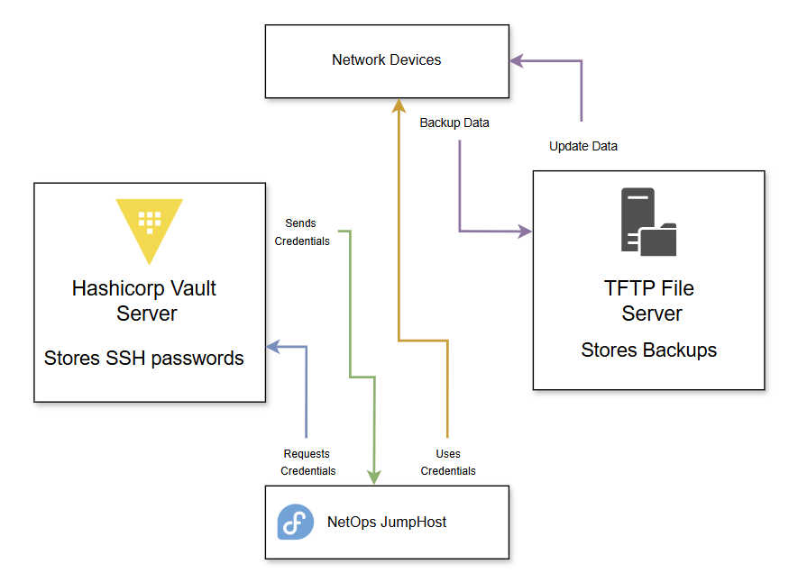

# Ansible playbooks

A repository that includes Ansible playbooks and Python scripts used for NetOps operation mini project orchestration.

In progress: All the uploaded code is from before I installed the ASA firewalls into the Homelab, so I'm in the process of creating playbooks for various tasks, such as image and running config backups.

# Flow Diagram

